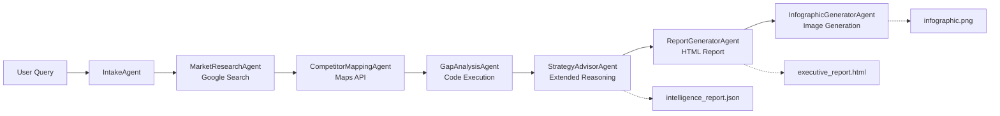

# Retail AI Location Strategy with Google ADK

A multi-agent AI pipeline for retail site selection, built with [Google Agent Development Kit (ADK)](https://google.github.io/adk-docs/) and Gemini.

<table>
  <thead>
    <tr>
      <th colspan="2">Key Features</th>
    </tr>
  </thead>
  <tbody>
    <tr>
      <td>🏗️</td>
      <td><strong>Production-Ready:</strong> Built with ADK for seamless deployment to <a href="https://cloud.google.com/run">Google Cloud Run</a> and <a href="https://cloud.google.com/vertex-ai/generative-ai/docs/agent-engine/overview">Vertex AI Agent Engine</a>.</td>
    </tr>
    <tr>
      <td>🔍</td>
      <td><strong>Multi-Agent Pipeline:</strong> 7 specialized agents for market research, competitor mapping, gap analysis, strategy recommendations, and report generation.</td>
    </tr>
    <tr>
      <td>🗺️</td>
      <td><strong>Real-World Data:</strong> Integrates Google Maps Places API for competitor mapping and live web search for market research.</td>
    </tr>
  </tbody>
</table>

## What It Does

Given a location and business type, this pipeline automatically:

- Researches the market using live web search
- Maps competitors using Google Maps Places API
- Calculates viability scores with Python code execution
- Generates strategic recommendations with extended reasoning
- Produces an HTML executive report and visual infographic

---

## Getting Started: From Zero to Running Agent in 1 Minute

**Prerequisites:** **[Python 3.10+](https://www.python.org/downloads/)**, **[uv](https://github.com/astral-sh/uv)**, **[Google Maps API key](https://console.cloud.google.com/apis/credentials)** (with Places API enabled)

You have two options to get started. Choose the one that best fits your setup:

*   A. **[Google AI Studio (Recommended)](#a-google-ai-studio-recommended)**: The quickest way to get started using a **Google AI Studio API key**. This method involves cloning the sample repository.
*   B. **[Google Cloud Vertex AI](#b-google-cloud-vertex-ai)**: Choose this path if you want to use an existing **Google Cloud project** for authentication and deployment. This method generates a new, prod-ready project using the [agent-starter-pack](https://goo.gle/agent-starter-pack) including all the deployment scripts required.

---

### A. Google AI Studio (Recommended)

You'll need a **[Google AI Studio API Key](https://aistudio.google.com/app/apikey)**.

#### Step 1: Clone Repository
Clone the repository and `cd` into the project directory.

```bash
git clone https://github.com/google/adk-samples.git
cd adk-samples/python/agents/retail-ai-location-strategy
```

#### Step 2: Set Environment Variables
Create a `.env` file in the `app` folder with your API keys (see `.env.example` for reference):

```bash
echo "GOOGLE_GENAI_USE_VERTEXAI=FALSE" >> app/.env
echo "GOOGLE_API_KEY=YOUR_AI_STUDIO_API_KEY" >> app/.env
echo "MAPS_API_KEY=YOUR_MAPS_API_KEY" >> app/.env
```

#### Step 3: Install & Run
From the `retail-ai-location-strategy` directory, install dependencies and start the server.

```bash
make install && make dev
```
Your agent is now running at `http://localhost:8501`.

---

### B. Google Cloud Vertex AI (via Agent Starter Pack)

Use the [Agent Starter Pack](https://goo.gle/agent-starter-pack) to create a production-ready project with deployment scripts. This is ideal for cloud deployment scenarios.

You'll need: **[Google Cloud SDK](https://cloud.google.com/sdk/docs/install)** and a **Google Cloud Project** with the **Vertex AI API** enabled.

<details>
<summary>📁 Alternative: Using the cloned repository with Vertex AI</summary>

If you've already cloned the repository (as in Option A) and want to use Vertex AI instead of AI Studio, create a `.env` file in the `app` folder with:

```bash
echo "GOOGLE_GENAI_USE_VERTEXAI=TRUE" >> app/.env
echo "GOOGLE_CLOUD_PROJECT=YOUR_PROJECT_ID" >> app/.env
echo "GOOGLE_CLOUD_LOCATION=us-central1" >> app/.env
echo "MAPS_API_KEY=YOUR_MAPS_API_KEY" >> app/.env
```

Make sure you're authenticated with Google Cloud:
```bash
gcloud auth application-default login
```

Then run `make install && make dev` to start the agent.
</details>

#### Step 1: Create Project from Template
This command uses the [Agent Starter Pack](https://goo.gle/agent-starter-pack) to create a new directory (`my-retail-agent`) with all the necessary code.
```bash
# Create and activate a virtual environment
python -m venv .venv && source .venv/bin/activate # On Windows: .venv\Scripts\activate

# Install the starter pack and create your project
pip install --upgrade agent-starter-pack
agent-starter-pack create my-retail-agent -a adk@retail-ai-location-strategy
```
<details>
<summary>⚡️ Alternative: Using uv</summary>

If you have [`uv`](https://github.com/astral-sh/uv) installed, you can create and set up your project with a single command:
```bash
uvx agent-starter-pack create my-retail-agent -a adk@retail-ai-location-strategy
```
This command handles creating the project without needing to pre-install the package into a virtual environment.
</details>

You'll be prompted to select a deployment option (Agent Engine or Cloud Run) and verify your Google Cloud credentials.

#### Step 2: Install & Run
Navigate into your **newly created project folder**, then install dependencies and start the server.
```bash
cd my-retail-agent && make install && make dev
```
Your agent is now running at `http://localhost:8501`.

## Cloud Deployment

> **Note:** Cloud deployment applies only to projects created with **agent-starter-pack** (Option B).

**Prerequisites:**
```bash
gcloud components update
gcloud config set project YOUR_PROJECT_ID
```

Deploy with the built-in [adk-web](https://github.com/google/adk-web) interface:

```bash
make deploy IAP=true
```

After deployment, grant users access to your IAP-protected service by following the [Manage User Access](https://cloud.google.com/run/docs/securing/identity-aware-proxy-cloud-run#manage_user_or_group_access) documentation.

For production deployments with CI/CD, see the [Agent Starter Pack Development Guide](https://googlecloudplatform.github.io/agent-starter-pack/guide/development-guide.html#b-production-ready-deployment-with-ci-cd).

---

## Agent Details

| Attribute | Description |
| :--- | :--- |
| **Interaction Type** | Workflow |
| **Complexity** | Advanced |
| **Agent Type** | Multi Agent (Sequential Pipeline) |
| **Components** | Multi-agent, Function calling, Web search, Google Maps API, Code execution, Image generation |
| **Vertical** | Retail / Real Estate |

## Interactive UI (Optional)

For a richer experience with real-time pipeline visualization:

```bash
# Terminal 1: Start the backend
cd app/frontend/backend
pip install -r requirements.txt
python main.py
# Runs at http://localhost:8000

# Terminal 2: Start the frontend
cd app/frontend
npm install --legacy-peer-deps
cp .env.local.example .env.local
npm run dev
# Runs at http://localhost:3000
```

Open `http://localhost:3000` to see the interactive dashboard with collapsible pipeline steps, live progress tracking, and downloadable reports.

See [app/frontend/README.md](app/frontend/README.md) for detailed frontend documentation.

---

## Example Prompts

| Region | Location | Business | Example Prompt |
|--------|----------|----------|----------------|
| Asia | Bangalore, India | Coffee Shop | "I want to open a coffee shop in Indiranagar, Bangalore" |
| Asia | Tokyo, Japan | Ramen Restaurant | "Analyze Shibuya, Tokyo for opening a ramen restaurant" |
| Asia | Singapore | Bubble Tea | "Where should I open a bubble tea shop in Orchard Road, Singapore?" |
| Americas | Austin, Texas | Fitness Studio | "Where should I open a fitness studio in Austin, Texas?" |
| Americas | Mexico City | Taco Restaurant | "Analyze Roma Norte, Mexico City for a taco restaurant" |
| Americas | Toronto, Canada | Craft Brewery | "Help me find a location for a craft brewery in Toronto's Distillery District" |
| Europe | London, UK | Bookstore Cafe | "Help me find the best location for a bookstore cafe in Shoreditch, London" |
| Europe | Berlin, Germany | Vegan Restaurant | "Analyze Berlin's Kreuzberg for opening a vegan restaurant" |
| Middle East | Dubai, UAE | Bakery | "I'm planning to open a bakery in Dubai Marina" |
| Oceania | Sydney, Australia | Juice Bar | "Analyze the market for a juice bar in Bondi Beach, Sydney" |

---

## Architecture



The pipeline is built as a `SequentialAgent` that orchestrates 7 specialized sub-agents, each handling a specific phase of the analysis.

---

## Project Structure

```
retail-ai-location-strategy/
├── Makefile              # Build and run commands
├── pyproject.toml        # Dependencies
├── .env.example          # Environment template
├── notebook/             # Jupyter notebooks
└── app/                  # Agent package
    ├── __init__.py       # Package init
    ├── .env              # Environment variables
    ├── agent.py          # Main SequentialAgent definition
    ├── config.py         # Model and auth configuration
    ├── sub_agents/       # Specialized agents
    │   ├── intake_agent.py
    │   ├── market_research.py
    │   ├── competitor_mapping.py
    │   ├── gap_analysis.py
    │   ├── strategy_advisor.py
    │   ├── report_generator.py
    │   └── infographic_generator.py
    ├── tools/            # Custom tools
    │   ├── places_search.py
    │   ├── html_report_generator.py
    │   └── image_generator.py
    ├── schemas/          # Pydantic schemas
    ├── callbacks/        # Pipeline callbacks
    └── frontend/         # Interactive UI (optional)
```

---

## Learn More

For detailed documentation, see **[DEVELOPER_GUIDE.md](DEVELOPER_GUIDE.md)**:

- [The Business Problem](DEVELOPER_GUIDE.md#the-business-problem) - Why this exists
- [Architecture Deep Dive](DEVELOPER_GUIDE.md#architecture-deep-dive) - State flow and agent communication
- [Agents and Tools](DEVELOPER_GUIDE.md#agents-and-tools) - Sub-agents, tools, callbacks, schemas
- [Configuration](DEVELOPER_GUIDE.md#configuration) - Model selection and retry options
- [Troubleshooting](DEVELOPER_GUIDE.md#troubleshooting) - Common issues and fixes

## Troubleshooting

If you encounter issues while setting up or running this agent, here are some resources to help you troubleshoot:
- [ADK Documentation](https://google.github.io/adk-docs/): Comprehensive documentation for the Agent Development Kit
- [Vertex AI Authentication Guide](https://cloud.google.com/vertex-ai/docs/authentication): Detailed instructions for setting up authentication
- [Agent Starter Pack Troubleshooting](https://googlecloudplatform.github.io/agent-starter-pack/guide/troubleshooting.html): Common issues

---

## Authors

Based on the original [Retail AI Location Strategy notebook](https://github.com/GoogleCloudPlatform/generative-ai/blob/main/gemini/use-cases/retail/retail_ai_location_strategy_gemini_3.ipynb) by [Lavi Nigam](https://github.com/lavinigam-gcp) and [Deepak Moonat](https://github.com/dmoonat).

---

## Disclaimer

This agent sample is provided for illustrative purposes only. It serves as a basic example of an agent and a foundational starting point for individuals or teams to develop their own agents.

Users are solely responsible for any further development, testing, security hardening, and deployment of agents based on this sample. We recommend thorough review, testing, and the implementation of appropriate safeguards before using any derived agent in a live or critical system.

---

## License

Apache 2.0 - See [LICENSE](LICENSE) for details.
